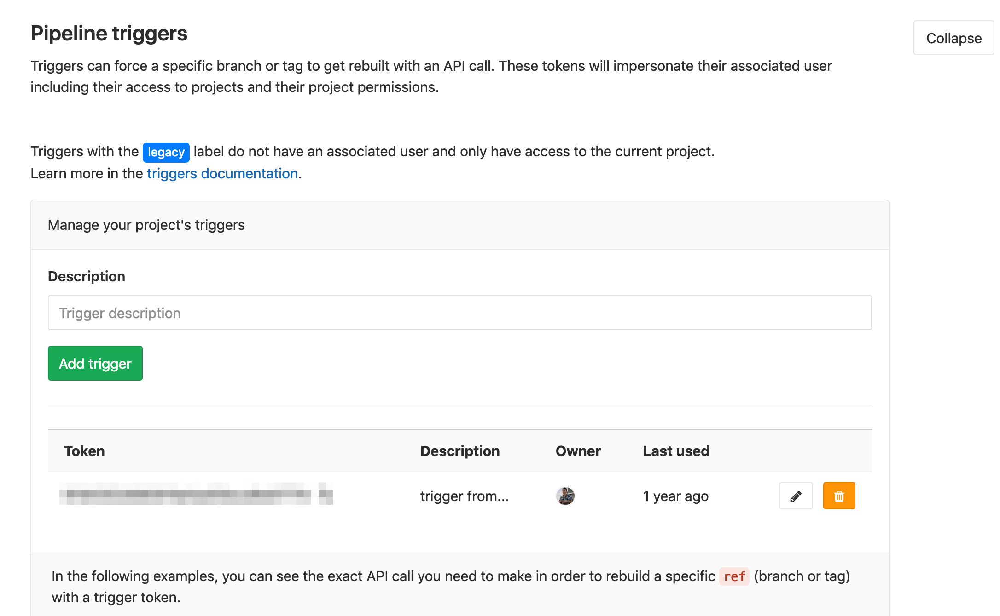

# 🚀 GitLab CI for GitHub Actions

[GitHub Action](https://github.com/features/actions) for trigger [gitlab-ci](https://about.gitlab.com/gitlab-ci) jobs.


## Usage

Trigger New GitLab CI Job.

```
action "Trigger New Job" {
  uses = "appleboy/gitlab-ci-action@master"
  secrets = [
    "GITLBA_PROJECT_ID",
    "GITLBA_TOKEN",
  ]
}
```

## GitLab Setting

See the detail documentation for [Triggering pipelines through the API](https://docs.gitlab.com/ee/ci/triggers/). How to get the token from a new trigger? You can add a new trigger by going to your project’s `Settings ➔ CI/CD` under Triggers.



How to get the project ID? going to your project’s `Settings ➔ General` under Gerneral project.


## Example

Specific the GitLab host URL:

```
action "Trigger New Job" {
  uses = "appleboy/gitlab-ci-action@master"
  env = {
    GITLBA_HOST = "https://example.com"
    DEBUG = "true"
  }
  secrets = [
    "GITLBA_PROJECT_ID",
    "GITLBA_TOKEN",
  ]
}
```

Other specific `branch` or `tag` name:

```
action "Trigger New Job" {
  uses = "appleboy/gitlab-ci-action@master"
  env = {
    DEBUG = "true"
    GITLBA_REF = "v1.1.1"
  }
  secrets = [
    "GITLBA_PROJECT_ID",
    "GITLBA_TOKEN",
  ]
}
```

## Environment variables

* GITLBA_HOST - Optional. gitlab-ci base url, default as `https://gitlab.com`
* GITLBA_REF - Optional. Triggers can be used to force a pipeline rerun of a specific ref (`branch` or `tag`) with an API call. Default as `master`.
* DEBUG - Optional. show the debug message.

## Secrets

* GITLBA_TOKEN - Required. A unique trigger token can be obtained when [adding a new trigger](https://docs.gitlab.com/ee/ci/triggers/#adding-a-new-trigger).
* GITLBA_PROJECT_ID - Required. project id.
